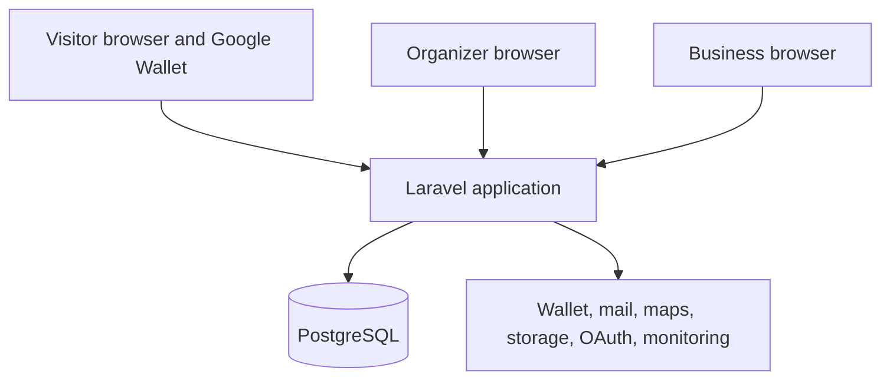

# **DeTuristaAndo** Architecture Overview

This document defines the technical boundaries for the [MVP01 requirements](../requirements.md). It leaves routine implementation choices to Laravel conventions and the active work item.

## Drivers

- Deliver one production-capable product with a small codebase and one developer workflow.
- Keep visit, progress, entitlement, and redemption rules correct under retries and concurrency.
- Keep organizer, business, and visitor access models separate.
- Make Google Wallet mandatory without making it authoritative.
- Operate within a free or low-cost initial deployment.
- Support later growth without introducing distributed-system cost in MVP01.

## Architecture decision

**DeTuristaAndo** uses a **conventional Laravel monolith with use-case Actions**.

Use conventional Laravel technical roots for real code, including `app/Actions`, `app/Models`, `app/Livewire`, `app/Http`, `app/Policies`, `app/Services`, `app/Integrations`, `app/Jobs`, `app/Events`, `app/Enums`, and `app/Data`. Product capability names may group real cohesive code within a technical root; they do not create formal modules, layers, or empty scaffolding.

A classified meaningful business command uses one project-owned `<Verb><Subject>Action::handle()`. An Action may coordinate authorization, its complete transaction, Eloquent, focused Services, and post-commit dispatch. Actions are a DeTuristaAndo convention, not an official Laravel or industry-wide standard. Routine writes, queries, framework callbacks, and mechanical wrappers use the clearest Laravel-native mechanism without an Action requirement.

Use Eloquent or the query builder by default. Add a focused Service, repository, interface, contract, DTO, enum, value object, query, or capability directory only when a documented current responsibility or boundary justifies it. Keep provider SDK behavior in project-owned Integrations.

See [ADR-007](decisions/007-conventional-laravel-monolith-with-use-case-actions.md).

## System context

The Laravel application owns all product decisions. Providers deliver identity, messages, maps, media, or card projections.

## Product capabilities

| Capability | Responsibility |
|---|---|
| Organizer Identity | Fortify identity, Socialite linking, organizer profile, and session. |
| Experience | Experience lifecycle, participants, goal, benefit definition, and publication readiness. |
| Business Access | Invitation, device activation, PIN access, permission scope, and revocation. |
| Discovery | Public search, experience projection, participant cards, map data, and acquisition source. |
| Participation | Anonymous participation, private credentials, private view, and card projection. |
| Visit and Progress | Confirmation eligibility, visit events, total visits, distinct progress, and goal transition. |
| Benefit | Capacity reservation, entitlement, expiry, and redemption. |
| Reporting and Audit | Product measures, business-own summary, audit events, and platform operations. |
| Integrations | Project-owned Wallet, mail, maps, storage, OAuth, and monitoring behavior. |

Capabilities identify coherent product responsibilities; they do not require formal modules, separate layers, or matching folders. Use direct Eloquent, explicit queries, events, or focused Services when they are the clearest fit. Presentation code must not reach across unrelated capability data.

## Design principles

The project uses design principles as decision tools. It does not use them as abstraction targets.

| Principle | Project application |
|---|---|
| KISS | Choose the smallest design that keeps the current behavior clear, correct, and testable. |
| YAGNI | Do not add extension points, generic layers, or provider options for unapproved future work. |
| DRY | Extract one stable business rule or repeated source of knowledge. Keep incidental code similarity when extraction would hide intent. |
| SOLID | Apply each principle where a real responsibility, substitution, interface, or dependency boundary exists. Do not measure compliance by the number of classes. |

For SOLID, use one reason to change as the main responsibility test. Add an abstraction only when a documented current responsibility or boundary needs it. Apply substitution and open extension rules only where a current implementation, test, or boundary need justifies them.

## Service and Repository policy

| Pattern | Use | Do not use |
|---|---|---|
| Focused Service | A reusable cohesive capability or composed read has a stable current responsibility. | A generic CRUD bucket, a capability-wide service, or a required Action-to-Service chain. |
| Repository or interface | A documented current persistence, substitution, test, or boundary need is clearer than direct Laravel use. | One repository per model, a generic base repository, or a wrapper around simple Eloquent CRUD. |
| Eloquent Model or query builder | Clear persistence, relationships, casts, scopes, cohesive local behavior, projections, aggregates, or bulk work. | A forced abstraction when direct Laravel use is clearer. |

Use Eloquent or the query builder by default. Models may own relationships, casts, scopes, and cohesive local behavior. Add another abstraction only for a documented current responsibility or boundary; symmetry, generic CRUD, anticipated reuse, and future possibility do not qualify.

## Dependency rules

- Livewire, HTTP handlers, console commands, jobs, and listeners use Laravel-native conventions; meaningful commands call an Action.
- The classified Action owns the complete transaction for its command and may coordinate policies, Eloquent, Models, focused Services, and post-commit dispatch.
- Routine reads and persistence use Eloquent or the query builder directly when that is clearest.
- Provider SDK code, mapping, and provider error handling stay in project-owned Integrations.
- Capabilities avoid cyclic coupling through clear current responsibilities, not formal layer rules.

Do not create an interface only to wrap one stable Laravel class, and do not add architecture tests for this decision.

## Core transactions

The classified Action owns each complete command transaction. When local product state is authoritative, dispatch the dependent provider effect after the transaction commits.

| Use case | Transaction boundary | External effect |
|---|---|---|
| Publish experience | Validate readiness and change state. | Queue invitations and public projection work. |
| Activate business | Consume invitation and register device access. | Record audit evidence. |
| Activate participation | Create participation and credentials. | Create Wallet object after commit. |
| Confirm visit | Create visit, update progress, and create entitlement when required. | Queue Wallet update after commit. |
| Redeem benefit | Lock entitlement and record one redemption. | Queue Wallet update after commit. |

External calls never occur inside the transaction that decides a visit or redemption. A retry uses an idempotency key and returns the prior domain result.

## Data model baseline

The initial relational model contains these concepts:

- organizers and social identities;
- experiences and participants;
- participant invitations and business device access;
- participations and hashed credentials;
- visits and progress projection;
- benefits, capacity, entitlements, and redemptions;
- Wallet mappings and synchronization attempts;
- audit events and acquisition sources.

PostgreSQL constraints and transactions enforce uniqueness and concurrency-sensitive rules. Application validation provides user-facing feedback but does not replace database integrity.

Use opaque public identifiers. Do not expose sequential database keys. Store a credential hash when the workflow does not require recovery of its original value.

## Access model

### Organizer

Fortify provides conventional session authentication. Socialite adds Google login. Application policies authorize ownership and platform operations.

### Participating business

A business is not a Laravel user in MVP01. It uses one experience-scoped device token plus PIN verification. Middleware restores the access context; policies still authorize each operation.

### Visitor

A visitor has no account. One credential opens the private view. A different credential can be presented for validation. Possessing that credential cannot create a visit without business confirmation.

See [ADR-003](decisions/003-scoped-non-account-access.md) and the [security architecture](security.md).

## Google Wallet

The Participation capability owns card state. A project-owned Wallet Integration receives project data and maps it to Google Wallet classes, objects, signed links, and updates.

The Integration must support:

- create or resolve the experience card class;
- create one object per participation;
- generate the Add to Google Wallet action;
- update progress and benefit state;
- expose the validation QR and private-view link;
- classify retryable and terminal provider errors.

The private web view remains fully usable when Wallet delivery fails. See [ADR-008](decisions/008-google-wallet-project-owned-integration.md).

## Other integrations

| Integration | MVP01 rule |
|---|---|
| Mail | Queue invitations and recovery messages; keep resend idempotent. |
| Maps | Use Leaflet, stored coordinates, and an approved OpenStreetMap-compatible tile service. Do not call a geocoder on every page view. |
| Media | Validate upload type, size, dimensions, and decode success. Keep storage behind Laravel Filesystem. |
| OAuth | Use Socialite with fixed callback configuration and safe account linking. |
| Monitoring | Capture structured application errors and release context without private credentials. |

Queue work can start with the database driver. Introduce Redis only after measured contention, throughput, or provider needs justify it.

## Runtime and deployment

### Development runtime

Laravel Sail is the mandatory local runtime. Docker Desktop groups the stack as `deturistaando`, with the project-prefixed services `deturistaando-laravel-app`, `deturistaando-postgres-db`, and `deturistaando-mailpit-dev`. The application image is `sail-deturistaando:dev`. Developers run Artisan, Composer, npm, tests, formatting, static analysis, and browser tests through Sail. Docker is the only required host dependency.

Developers copy the versioned `.env.dev.example` contract to the ignored `.env`. Production deployments use `.env.example` as a separate template and inject all secrets through the runtime environment; no `.env.dev` file exists.

The Wave 0 application baseline installs Socialite and defines the Google OAuth environment contract without committing credentials. The organizer login callback and safe identity-linking workflow remain part of the Wave 3 Organizer Identity slice.

### Production runtime

Production uses an independent `Dockerfile` at the repository root rather than the Sail development image. MVP01 uses:

- One web process.
- One queue worker and scheduler process when the hosting provider supports them.
- Managed PostgreSQL.
- External object storage when local disk is ephemeral.
- HTTPS termination and environment-managed secrets.
- One versioned Docker image promoted through environments.

The selected free-tier provider must support the visit flow reliably, background work, database backups, and required credentials. Provider selection requires a technical spike before it becomes an ADR.

The production image pins PHP 8.4, Composer 2, and Node.js 24 build stages by version and digest. Its final Alpine runtime pins nginx and Supervisor, runs as `www-data`, serves the `/up` health check on port `8080`, writes logs to standard streams, and contains neither build tools nor embedded environment files. Transitive Alpine libraries remain within the pinned Alpine release so compatible security patches are not blocked. Laravel is optimized at container startup, but migrations remain an explicit deployment operation.

The runtime baseline targets medium traffic: nginx limits request bodies to 10 MB, compresses and caches only versioned Vite assets, and sends requests exclusively through `public/index.php`; PHP-FPM recycles workers and caps long requests. An explicit hash-aware location routes Livewire 4 endpoints to Laravel instead of treating them as static files, while Flux continues through the same front-controller fallback. Livewire and Flux control the cache headers for their own versioned scripts; interactive update and upload endpoints remain dynamic. Nginx reaches PHP-FPM through a private Unix socket owned by `www-data`, avoiding a same-container TCP listener without retaining idle FastCGI connections. Dedicated Nginx buffering directories are created for and owned by the rootless runtime user so disk spill remains available under sustained load. Baseline OWASP response headers are emitted by nginx while `.well-known` remains available for passkeys. TLS and HSTS belong to the deployment edge, where HTTPS is actually terminated. These capacity values are starting points and must be adjusted from production measurements rather than treated as universal limits.

### Continuous integration runtime

GitHub Actions uses an ephemeral hosted runner and executes PHP, Composer, and Node commands directly on that runner. Sail remains mandatory only for local development. CI uses containers where an isolated service or tool provides a clear boundary: PostgreSQL supplies the disposable integration database, Gitleaks scans repository history, and Playwright will provide browser dependencies when complete product journeys enter the gate.

The independent production `Dockerfile` remains the deployable artifact. Building and verifying it in GitHub Actions is a separate future obligation and does not require Sail. See [ADR-005](decisions/005-sail-development-and-production-container.md) for the local and production container decision and [ADR-006](decisions/006-lightweight-ci-runtime.md) for the refined CI boundary.

## Environments and observability

Use local, test, staging, and production configuration. Staging can share provider sandbox resources but must not share production credentials or visitor data.

Production reports:

- health and queue state;
- unhandled errors with release and correlation context;
- validation latency and result rate;
- Wallet synchronization failures;
- audit evidence for sensitive operations.

Do not add a full metrics platform before the chosen hosting environment and incident needs justify it.

## Non-goals

MVP01 does not use microservices, Kubernetes, event sourcing, CQRS infrastructure, Redis as a required dependency, a public API, a data warehouse, or multi-region deployment.

## Decisions

- [ADR-001: Modular monolith with hexagonal architecture](decisions/001-modular-monolith-and-hexagonal-architecture.md) — superseded by ADR-007; unchanged historical record.
- [ADR-007: Conventional Laravel monolith with use-case Actions](decisions/007-conventional-laravel-monolith-with-use-case-actions.md) — current application architecture decision.
- [ADR-002: Google Wallet outside the core domain](decisions/002-google-wallet-delivery-adapter.md) — superseded by ADR-008; unchanged historical record.
- [ADR-008: Project-owned Google Wallet Integration](decisions/008-google-wallet-project-owned-integration.md) — current Google Wallet Integration decision.
- [ADR-003: Organizer accounts and scoped non-account access](decisions/003-scoped-non-account-access.md).
- [ADR-004: Official Laravel Livewire application stack](decisions/004-laravel-livewire-application-stack.md).
- [ADR-005: Laravel Sail for development and an independent production image](decisions/005-sail-development-and-production-container.md).
- [ADR-006: Lightweight CI runtime](decisions/006-lightweight-ci-runtime.md).
