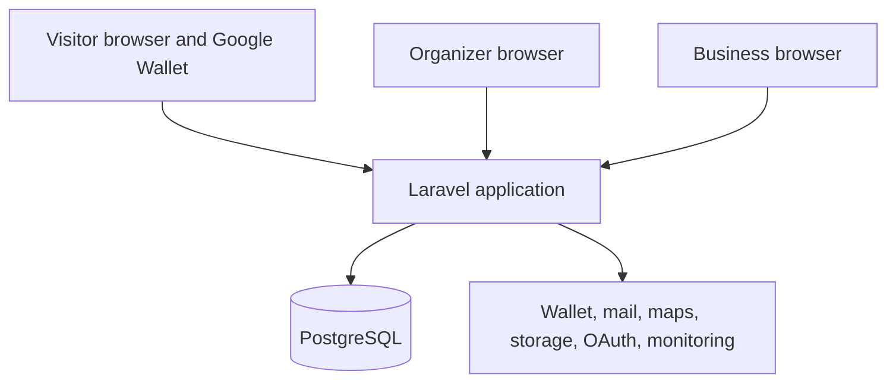

# **DeTuristaAndo** Architecture Overview

This document defines the technical boundaries for the [MVP01 requirements](../requirements.md). It leaves routine implementation choices to Laravel conventions and the active work item.

## Drivers

- Deliver one production-capable product with a small codebase and one developer workflow.
- Keep visit, progress, entitlement, and redemption rules correct under retries and concurrency.
- Keep organizer, business, and visitor access models separate.
- Make Google Wallet mandatory without making it authoritative.
- Operate within a free or low-cost initial deployment.
- Support later growth without introducing distributed-system cost in MVP01.

## Architecture decision

**DeTuristaAndo** uses a **modular monolith with hexagonal architecture**.

Each business module separates these areas:

- **Domain:** entities, value objects, policies, and business rules.
- **Application:** use cases, transaction coordination, and ports.
- **Inbound adapters:** HTTP, Livewire, console commands, and queued jobs.
- **Outbound adapters:** Eloquent persistence and external providers.

Dependencies point from adapters toward the application and domain. The architecture defines this direction. It does not require one interface, service, repository, or folder for every class.

See [ADR-001](decisions/001-modular-monolith-and-hexagonal-architecture.md).

## System context

The Laravel application owns all product decisions. Providers deliver identity, messages, maps, media, or card projections.

## Modules

| Module | Responsibility |
|---|---|
| Organizer Identity | Fortify identity, Socialite linking, organizer profile, and session. |
| Experience | Experience lifecycle, participants, goal, benefit definition, and publication readiness. |
| Business Access | Invitation, device activation, PIN access, permission scope, and revocation. |
| Discovery | Public search, experience projection, participant cards, map data, and acquisition source. |
| Participation | Anonymous participation, private credentials, private view, and card projection. |
| Visit and Progress | Confirmation eligibility, visit events, total visits, distinct progress, and goal transition. |
| Benefit | Capacity reservation, entitlement, expiry, and redemption. |
| Reporting and Audit | Product measures, business-own summary, audit events, and platform operations. |
| Integrations | Wallet, mail, maps, storage, OAuth, and monitoring adapters. |

Modules own their tables and domain behavior. Cross-module access occurs through application services, explicit queries, or domain events inside the same process. Do not query another module's tables from presentation code.

## Design principles

The project uses design principles as decision tools. It does not use them as abstraction targets.

| Principle | Project application |
|---|---|
| KISS | Choose the smallest design that keeps the current behavior clear, correct, and testable. |
| YAGNI | Do not add extension points, generic layers, or provider options for unapproved future work. |
| DRY | Extract one stable business rule or repeated source of knowledge. Keep incidental code similarity when extraction would hide intent. |
| SOLID | Apply each principle where a real responsibility, substitution, interface, or dependency boundary exists. Do not measure compliance by the number of classes. |

For SOLID, use one reason to change as the main responsibility test. Use narrow ports at volatile boundaries. Use dependency inversion for domain code that must not know Laravel presentation types, Eloquent details, or provider SDKs. Apply substitution and open extension rules only where more than one implementation or a credible change exists.

## Service and Repository policy

| Pattern | Use | Do not use |
|---|---|---|
| Application Service | One named use case coordinates authorization, a transaction, domain behavior, and external work after commit. | A generic service that groups unrelated CRUD methods. |
| Domain Service | A domain rule spans entities or value objects and has no natural entity owner. | Logic that belongs to an entity, value object, or application workflow. |
| Repository | The domain or application needs an aggregate persistence boundary, a meaningful substitute, or isolated tests. | One repository per model, a generic base repository, or a wrapper around simple Eloquent CRUD. |

Use Eloquent or the query builder inside an outbound adapter for simple persistence and read projections. Keep visit, progress, entitlement, and redemption rules independent from Eloquent. Add a port only when it protects a current business rule, a provider boundary, or a verified test need.

## Dependency rules

- HTTP and Livewire components call application use cases.
- Application use cases coordinate transactions and domain behavior.
- Domain code does not import Livewire, Eloquent, or provider SDK types.
- Simple read models and routine persistence can use Eloquent in an adapter without a repository port.
- Provider adapters implement narrow project-owned ports when provider coupling crosses into the application.
- Modules do not depend on a cyclic chain.

Use architecture tests for dependency direction and module isolation. Do not create an interface only to wrap one stable Laravel class.

## Core transactions

| Use case | Transaction boundary | External effect |
|---|---|---|
| Publish experience | Validate readiness and change state. | Queue invitations and public projection work. |
| Activate business | Consume invitation and register device access. | Record audit evidence. |
| Activate participation | Create participation and credentials. | Create Wallet object after commit. |
| Confirm visit | Create visit, update progress, and create entitlement when required. | Queue Wallet update after commit. |
| Redeem benefit | Lock entitlement and record one redemption. | Queue Wallet update after commit. |

External calls never occur inside the transaction that decides a visit or redemption. A retry uses an idempotency key and returns the prior domain result.

## Data model baseline

The initial relational model contains these concepts:

- organizers and social identities;
- experiences and participants;
- participant invitations and business device access;
- participations and hashed credentials;
- visits and progress projection;
- benefits, capacity, entitlements, and redemptions;
- Wallet mappings and synchronization attempts;
- audit events and acquisition sources.

PostgreSQL constraints and transactions enforce uniqueness and concurrency-sensitive rules. Application validation provides user-facing feedback but does not replace database integrity.

Use opaque public identifiers. Do not expose sequential database keys. Store a credential hash when the workflow does not require recovery of its original value.

## Access model

### Organizer

Fortify provides conventional session authentication. Socialite adds Google login. Application policies authorize ownership and platform operations.

### Participating business

A business is not a Laravel user in MVP01. It uses one experience-scoped device token plus PIN verification. Middleware restores the access context; policies still authorize each operation.

### Visitor

A visitor has no account. One credential opens the private view. A different credential can be presented for validation. Possessing that credential cannot create a visit without business confirmation.

See [ADR-003](decisions/003-scoped-non-account-access.md) and the [security architecture](security.md).

## Google Wallet

The Participation module owns card state. A Wallet port receives project data and maps it to Google Wallet classes, objects, signed links, and updates.

The adapter must support:

- create or resolve the experience card class;
- create one object per participation;
- generate the Add to Google Wallet action;
- update progress and benefit state;
- expose the validation QR and private-view link;
- classify retryable and terminal provider errors.

The private web view remains fully usable when Wallet delivery fails. See [ADR-002](decisions/002-google-wallet-delivery-adapter.md).

## Other integrations

| Integration | MVP01 rule |
|---|---|
| Mail | Queue invitations and recovery messages; keep resend idempotent. |
| Maps | Use Leaflet, stored coordinates, and an approved OpenStreetMap-compatible tile service. Do not call a geocoder on every page view. |
| Media | Validate upload type, size, dimensions, and decode success. Keep storage behind Laravel Filesystem. |
| OAuth | Use Socialite with fixed callback configuration and safe account linking. |
| Monitoring | Capture structured application errors and release context without private credentials. |

Queue work can start with the database driver. Introduce Redis only after measured contention, throughput, or provider needs justify it.

## Runtime and deployment

### Development runtime

Laravel Sail is the mandatory local runtime. Its container topology includes the application, PostgreSQL, mail, and every dependency required to develop or verify the application. Developers run Artisan, Composer, npm, tests, formatting, static analysis, and browser tests through Sail. Docker is the only required host dependency.

The Wave 0 application baseline installs Socialite and defines the Google OAuth environment contract without committing credentials. The organizer login callback and safe identity-linking workflow remain part of the Wave 3 Organizer Identity slice.

### Production runtime

Production uses an independent `Dockerfile` at the repository root rather than the Sail development image. MVP01 uses:

- One web process.
- One queue worker and scheduler process when the hosting provider supports them.
- Managed PostgreSQL.
- External object storage when local disk is ephemeral.
- HTTPS termination and environment-managed secrets.
- One versioned Docker image promoted through environments.

The selected free-tier provider must support the visit flow reliably, background work, database backups, and required credentials. Provider selection requires a technical spike before it becomes an ADR.

The production image uses pinned supported versions, a non-root process where the base image permits it, a health check, and no development dependencies or embedded secrets.

CI runs tests and quality checks in containers and must build the root production `Dockerfile` successfully. See [ADR-005](decisions/005-sail-development-and-production-container.md).

## Environments and observability

Use local, test, staging, and production configuration. Staging can share provider sandbox resources but must not share production credentials or visitor data.

Production reports:

- health and queue state;
- unhandled errors with release and correlation context;
- validation latency and result rate;
- Wallet synchronization failures;
- audit evidence for sensitive operations.

Do not add a full metrics platform before the chosen hosting environment and incident needs justify it.

## Non-goals

MVP01 does not use microservices, Kubernetes, event sourcing, CQRS infrastructure, Redis as a required dependency, a public API, a data warehouse, or multi-region deployment.

## Decisions

- [ADR-001: Modular monolith with hexagonal architecture](decisions/001-modular-monolith-and-hexagonal-architecture.md).
- [ADR-002: Google Wallet outside the core domain](decisions/002-google-wallet-delivery-adapter.md).
- [ADR-003: Organizer accounts and scoped non-account access](decisions/003-scoped-non-account-access.md).
- [ADR-004: Official Laravel Livewire application stack](decisions/004-laravel-livewire-application-stack.md).
- [ADR-005: Laravel Sail for development and an independent production image](decisions/005-sail-development-and-production-container.md).
