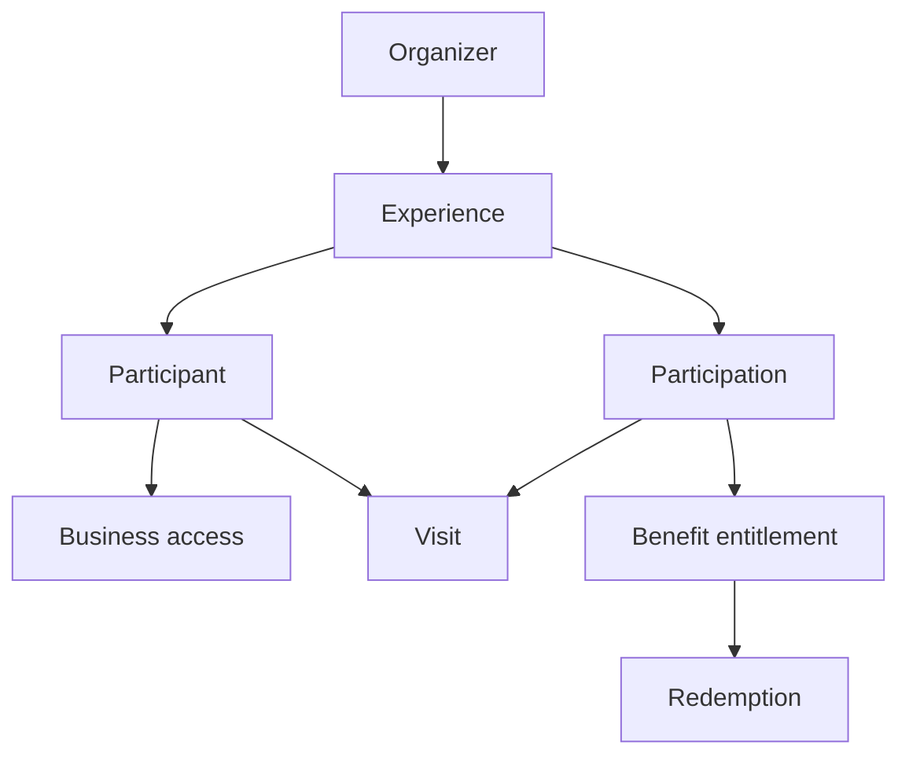

# **DeTuristaAndo** Conceptual Design

This document defines the actors, domain language, state, and rules of **DeTuristaAndo**. The [market analysis](market-analysis.md) defines why the product has this scope.

## Product model

An organizer publishes an experience with businesses that were coordinated outside the platform. A visitor activates one anonymous participation and can save its card in Google Wallet. Businesses confirm visits. The system counts distinct businesses and makes one benefit available when the visitor reaches the `K/N` goal.

An experience defines participants but does not define visit order.

## Principles

- Give value before asking the visitor to act.
- Require no visitor account or contact data.
- Give each business only the access required for its experience.
- Keep sales, payments, inventory, and participant agreements outside the platform.
- Separate public discovery from private participation and business confirmation.
- Keep server state authoritative when an external provider is unavailable.

## Actors

| Actor | Responsibility | Boundary |
|---|---|---|
| Visitor | Discover an experience, activate a participation, present a credential, and use one benefit. | Cannot confirm visits or redemptions. |
| Organizer | Configure, publish, operate, and close an owned experience. | Must coordinate participants and benefit responsibility outside the platform. |
| Participating business | Share public material, confirm visits, perform authorized redemptions, and view own activity. | Cannot edit rules or view another business. |
| Platform operator | Maintain service integrity and respond to abuse or incidents. | Does not organize experiences or negotiate participation. |

## Domain language

| Term | Meaning |
|---|---|
| Experience | Time-bound proposal that groups participating businesses under common rules. |
| Participant | Business or stand included in an experience. |
| Participation | Anonymous visitor state inside one experience. |
| Experience card | Google Wallet and private web representations of a participation. |
| Public QR | Code that opens an experience or identifies its acquisition source. |
| Private view credential | Opaque value that opens one participation for its holder. |
| Validation credential | Separate opaque value presented to a business for confirmation. |
| Visit | Immutable record created after an authorized confirmation. |
| Distinct progress | Number of different participants with at least one accepted visit. |
| Goal `K/N` | Requirement to visit `K` different participants from `N` available participants. |
| Benefit | Non-monetary advantage defined by the organizer. |
| Entitlement | One participation's right to use an available benefit. |
| Redemption | Final authorized use of an entitlement. |
| Business access | Revocable device and PIN access scoped to one participant and experience. |

## Relationships

The experience owns its rules and participants. The participation owns visitor progress. A business access can act only for its participant. A completed goal can create one entitlement.

## Experience configuration

An experience needs:

- Public identity, description, category, locality, and visual assets.
- Discovery mode: one venue or distributed locations.
- Visit and redemption periods.
- At least two participants with public location information.
- A goal where `2 ≤ K ≤ N`.
- One benefit with conditions, owner, capacity rule, expiry, and redemption points.

The organizer can save an incomplete draft. Publication requires all operational information.

## State models

### Experience

| State | Meaning | Main transitions |
|---|---|---|
| Draft | Private and editable. | Publish or cancel. |
| Published | Public before the visit period. | Start, correct public content, or cancel. |
| Active | Accepts eligible visits. | Enter redemption-only period or cancel. |
| Redemption | Stops new visits and allows valid redemption. | Finish. |
| Finished | Read-only final state. | None. |
| Cancelled | Operations stop and the public page explains the state. | None. |

Structural rules become immutable after the first participation. Public text can be corrected when the change does not alter visitor eligibility or benefit conditions.

### Business access

| State | Meaning |
|---|---|
| Invited | The one-time activation link is valid. |
| Active | The registered device and PIN can use permitted operations. |
| Revoked | The organizer or platform disabled access. |
| Expired | The invitation or experience ended. |

### Participation and benefit

| State | Meaning |
|---|---|
| Active | Visits can update progress. |
| Goal reached | Distinct progress reached `K`; later visits remain allowed while the experience is active. |
| Closed | No later visit can change progress. |
| Benefit available | One entitlement can be redeemed under published conditions. |
| Benefit redeemed | The entitlement was consumed once. |
| Benefit expired | The redemption deadline passed. |

## Main workflows

### Create and publish

1. The organizer authenticates.
2. The organizer configures the experience and participants.
3. The system shows landing and Wallet previews.
4. The system checks publication readiness.
5. Publication creates the public page, QR material, and participant invitations.

### Activate a business

1. The operator opens an unexpired invitation.
2. The page identifies the organizer, experience, and participant.
3. The operator confirms, registers the device, and defines a PIN.
4. The workspace exposes public material, validation, redemption when authorized, and own activity.

### Activate a participation

1. The visitor opens a published experience.
2. The visitor reviews participants, map, goal, benefit, and dates.
3. The system creates an anonymous participation.
4. The visitor receives the private web view and Google Wallet action.

### Confirm a visit

1. A business scans the validation credential or enters its manual code.
2. The system checks experience, access, participant, participation, period, and prior operation.
3. The operator reviews the expected result and confirms.
4. The system creates one visit, updates total and distinct progress, and creates an entitlement when required.
5. The system confirms the result and requests a Wallet update.

### Redeem a benefit

1. An authorized point reads the validation credential.
2. The system shows the entitlement and conditions.
3. The operator confirms redemption.
4. The system records one final redemption and updates the card.

## Invariants

- One participation belongs to one experience.
- Public QR codes never contain private credentials or create visits.
- Private-view and validation credentials are different opaque values.
- Only active business access can request a visit or redemption.
- An accepted visit is immutable.
- The first visit to a participant increases distinct progress by one.
- A repeated visit increases total visits only.
- Visit order has no effect.
- Goal completion creates at most one entitlement.
- Capacity reservation and redemption are atomic and idempotent.
- Redemption does not reset participation or visits.
- A provider failure does not reverse an accepted domain operation.
- Product reports describe recorded activity, not sales or economic impact.

## Recovery behavior

| Condition | Expected behavior |
|---|---|
| Camera unavailable | Keep manual-code entry in the same validator. |
| Wallet unavailable | Keep the private web participation usable. |
| Wallet update fails | Preserve domain state and retry the external update. |
| Connection fails after confirmation | Return the prior idempotent result on retry. |
| Device is lost | Revoke access and issue a new activation. |
| Experience is inactive | Reject the operation and show the applicable state. |
| Benefit capacity is exhausted | Apply the published capacity rule and do not over-allocate. |

## MVP01 boundary

MVP01 implements the complete model in this document for one free production release. Later increments can add reusable business relationships, more Wallet platforms, commercial services, or richer analytics. They must not change the meaning of visits already recorded.
