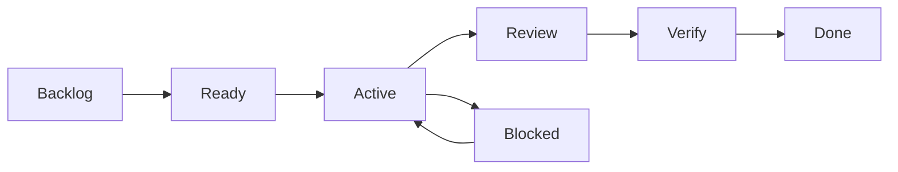

# **DeTuristaAndo** Development Workflow

This document defines a Lean delivery flow for **DeTuristaAndo**. Work is refined close to implementation and remains traceable to the [requirements](../requirements.md).

## Delivery model

- Use Kanban and continuous flow instead of fixed-scope sprints.
- Limit active implementation to one primary work item.
- Deliver vertical slices that produce an observable outcome.
- Refine only the next ready items.
- Integrate frequently through short-lived branches.
- Keep documentation and code in the same change when they describe the same behavior.

## Board



| State | Entry rule | Exit rule |
|---|---|---|
| Backlog | Valuable idea or identified defect. | Scope and priority are clear enough to refine. |
| Ready | Meets Definition of Ready. | Development starts and WIP is available. |
| Active | One owner is changing code or documentation. | Local evidence is complete. |
| Review | Pull request is focused and self-reviewed. | Required feedback and CI are complete. |
| Verify | Change is merged or deployed to the target test environment. | Acceptance and operational checks pass. |
| Done | Required evidence exists and documentation is current. | Reopen only for a new defect or changed requirement. |
| Blocked | External decision, access, provider, or defect prevents progress. | Blocker and next action are resolved. |

WIP limit is one item in `Active` for the primary developer. A blocked item does not justify starting several unrelated features.

## Work item

Each item contains only the information required to implement and verify one outcome:

- Title and user or system outcome.
- Related requirement IDs.
- Included and excluded scope.
- Acceptance examples and important rejection paths.
- Security, data, provider, or migration risk.
- Verification method.
- Documentation affected.

Do not copy full requirements or architecture sections into the item. Link to the authoritative source.

Use an outcome-oriented title with at most one primary requirement ID, such as `[REQ-HOM-001] Present the product home page`. Never concatenate several requirement IDs in a title. Record the primary, related, and cross-cutting requirement IDs in the item body so the title remains readable. Maintenance and documentation items that do not implement an authoritative requirement do not need a fabricated requirement prefix.

A draft must become a repository issue before it enters `Active`. The issue is the durable unit linked to its branch, pull request, checks, and resulting commit.

## Definition of Ready

An item is ready when:

- the outcome and owner are clear;
- upstream product and domain terms exist;
- dependencies and external access are known;
- acceptance can be verified;
- the item fits one reviewable pull request or has a safe split;
- unresolved decisions that change the solution are closed.

## Definition of Done

An item is done when:

- acceptance behavior works;
- relevant automated tests pass;
- authorization, failure, and retry paths are covered when applicable;
- formatting, static analysis, build, and required scans pass;
- migrations are reversible or have an explicit recovery path;
- observability is sufficient for the changed operation;
- owning documentation is updated;
- the deployed or staging flow is verified when the change affects integration.

Delivery evidence depends on the type of change:

- Versioned work links the pull request and the resulting commit on `main`.
- The one-time repository baseline exception links its direct initial commit.
- GitHub configuration that does not exist in Git history links the stable Project, ruleset, or settings resource and records the verification date.

The two Done drafts created before the issue-first gate remain historical drafts with explicit evidence. They are not precedent for bypassing the repository issue, pull-request, or protected-branch workflow.

## Initial delivery slices

The initial sequence follows risk and produces end-to-end evidence early:

1. Laravel 13 project, Livewire starter kit, base Socialite Google configuration, Sail with PostgreSQL and mail, root production Dockerfile, CI, and dark neon design tokens.
2. Google Wallet technical spike: class, object, web issue, QR, and update.
3. Organizer login, safe identity linking, and empty experience workspace.
4. Experience draft, participants, goal, benefit, and preview.
5. Publication, public landing, discovery QR, and invitation.
6. Business activation, device access, PIN, and validator shell.
7. Anonymous participation, private view, and Wallet delivery.
8. Visit confirmation, distinct progress, idempotency, and Wallet update.
9. Entitlement, capacity, redemption, and audit.
10. Reporting, recovery, accessibility, performance, and deployment hardening.

The Wallet spike occurs before broad feature work because provider approval and update behavior are the largest external uncertainty.

## Local development environment

Laravel Sail is mandatory for development. Docker is the only required host dependency; PHP, Composer, Node, PostgreSQL, and the local mail service run in containers. Add another local dependency to the Sail topology instead of making it a host prerequisite.

On a fresh clone, create the local environment file and install Composer dependencies through Docker before invoking Sail:

```bash
cp .env.example .env
docker run --rm \
    --user "$(id -u):$(id -g)" \
    --volume "$(pwd):/app" \
    --workdir /app \
    composer:2 composer install --no-interaction
./vendor/bin/sail artisan key:generate
```

Use the repository-local Sail executable for application commands:

```bash
./vendor/bin/sail up -d
./vendor/bin/sail artisan <command>
./vendor/bin/sail composer <command>
./vendor/bin/sail npm <command>
./vendor/bin/sail test
```

Run `./vendor/bin/sail npm install` once after cloning to install frontend dependencies and activate the versioned Husky hooks. Keep Sail running while committing and pushing because both hooks execute their checks inside the application container.

The baseline Sail topology exposes the application at `http://localhost:8000`, PostgreSQL on port `5432`, and the Mailpit inbox at `http://localhost:8025`. Google OAuth credentials remain empty in `.env.example`; local values belong only in the ignored `.env` file. The redirect contract is `${APP_URL}/auth/google/callback`, while the route and account-linking flow remain part of the organizer-authentication slice.

Formatting, static analysis, frontend checks, and Playwright also run through Sail. Production uses the independent `Dockerfile` at the repository root; it does not reuse the Sail development image. See [ADR-005](../architecture/decisions/005-sail-development-and-production-container.md).

## Git and pull requests

- Use GitHub Flow: branch from `main`, open a pull request, pass the required checks, merge, and delete the branch.
- Protect `main`; keep it releasable.
- Use one of these branch prefixes: `feat/`, `fix/`, `chore/`, `docs/`, `style/`, `refactor/`, `perf/`, `test/`, `build/`, `ci/`, or `revert/`. The suffix uses lowercase letters, digits, dots, underscores, or hyphens. Dependabot's generated `dependabot/` branches are also valid.
- Use Conventional Commits with a short subject and useful body when rationale is not obvious.
- Keep one outcome per pull request.
- Rebase or update before merge and prefer squash merge for a focused history.
- Do not use GitFlow, long-lived release branches, or mandatory second-person approval for a one-developer project.

The repository baseline is established by one non-empty root commit before branch protection. It is the only direct-to-`main` exception; every later change follows GitHub Flow.

The pull-request description states outcome, requirement IDs, risk, evidence, screenshots for UI changes, and follow-up work that is explicitly excluded. It must include `Closes #N`, `Fixes #N`, or `Resolves #N` for at least one repository issue labeled `status:approved`. Apply exactly one `type:*` label to the pull request.

Dependabot maintenance is the only operational exception to issue linkage: a pull request authored by `dependabot[bot]` from a matching `dependabot/` branch may omit the closing reference and approved issue, but must carry exactly the `type:chore` label. Human pull requests and every other bot remain subject to the full policy.

Local quality gates increase in cost without replacing CI:

1. During development, run the smallest focused test that proves the behavior being changed.
2. Pre-commit runs Pint, Larastan, and the Unit suite with a target budget of 90 seconds.
3. Pre-push creates the frontend production build before running all current PHP quality checks and tests, with a target budget of three minutes.
4. Pull-request CI repeats the complete required baseline in a disposable environment with PostgreSQL.
5. Coverage and critical Chromium browser tests enter pre-push and CI only after owned domain rules and complete browser journeys exist.

If a local gate repeatedly exceeds its budget, move the expensive portion to CI instead of normalizing `--no-verify`.

## AI-assisted development

GentleAI and coding agents can analyze, implement, test, and review. They do not own acceptance.

- Give the agent the smallest authoritative document set needed for the item.
- Ask for a plan before broad or risky changes.
- Inspect generated authorization, transactions, migrations, external calls, and tests.
- Run deterministic tools after every generated change.
- Do not provide production secrets or unnecessary personal data.
- Reject abstractions, dependencies, and scope that the active item does not require.

## CI/CD flow

The current automation baseline uses a disposable GitHub-hosted runner with PHP 8.4, Composer 2, Node.js 24, and an ephemeral PostgreSQL 16 Alpine service. It installs Composer and npm dependencies from their committed lock files, runs the PHP quality and test suite, builds frontend assets, validates pull-request policy, and schedules weekly Dependabot updates. Local development remains Sail-based; CI does not start Sail or Mailpit.

GitHub Copilot Code Review and the Copilot coding agent are not part of Copilot Free, so neither is configured. Human acceptance and deterministic CI remain authoritative.

The delivery target is:

1. The pull request runs the checks currently available in the [quality strategy](../quality-strategy.md).
2. Merge creates one versioned deployable image.
3. The same image is promoted to staging.
4. Staging runs migration, health, and critical-flow smoke tests.
5. Production deployment uses the verified image and environment configuration.
6. The release verifies health, queue state, migration, and the main experience flow.
7. A failed verification triggers rollback or the documented recovery path.

Playwright browser gates and the production-image build remain deferred until their dedicated Wave 0 items provide the browser harness and root `Dockerfile`.

Use GitHub Actions and GitHub Projects when available. Do not add a separate project-management platform for MVP01.

## Flow and delivery metrics

Track a small set of signals from the first implementation item:

| Metric | Purpose |
|---|---|
| Cycle time | Time from `Active` to `Done`; reveals oversized or blocked work. |
| Lead time | Time from commitment to production; shows delivery delay. |
| Deployment frequency | Shows whether small changes can reach production safely. |
| Change failure rate | Share of deployments that require rollback, hotfix, or incident response. |
| MTTR | Time to restore the product after a production failure. |
| Blocked time | Shows provider, decision, or environment friction. |

Record a baseline before setting improvement targets. Metrics support retrospection and must not become quotas.

## Decision and documentation rule

Update an existing authoritative document for normal product or technical refinement. Create an ADR only for a durable cross-cutting decision with credible alternatives and meaningful reversal cost.

At the end of each completed slice, remove stale detail, keep links valid, and confirm that the README still describes the product rather than the implementation history.
