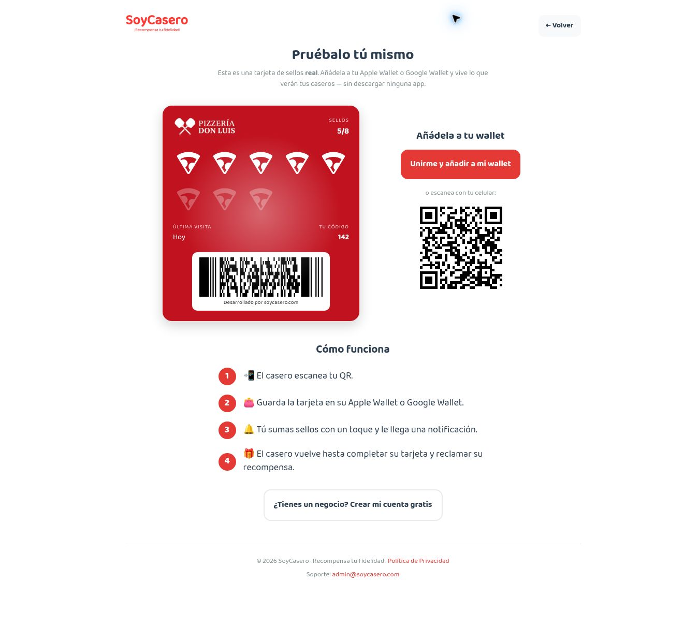
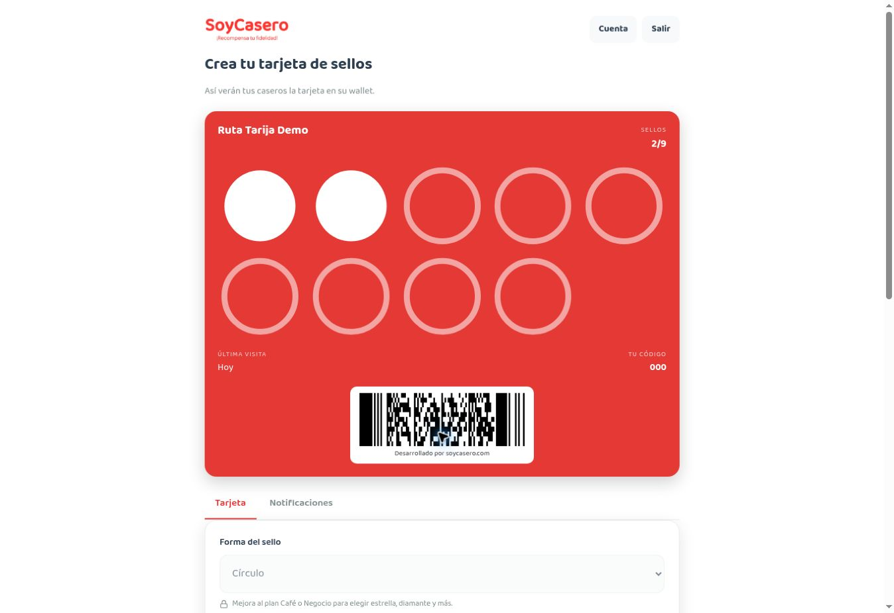
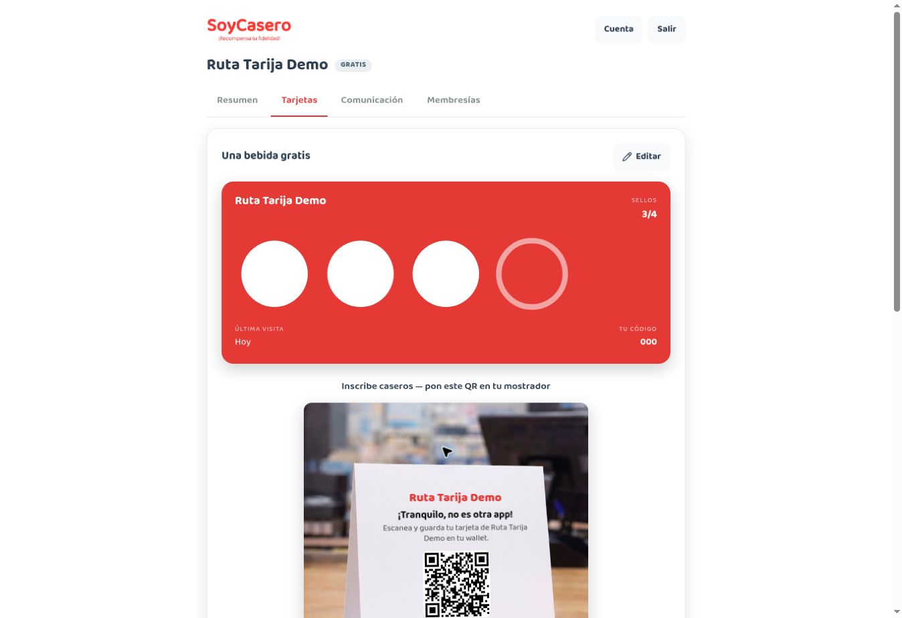
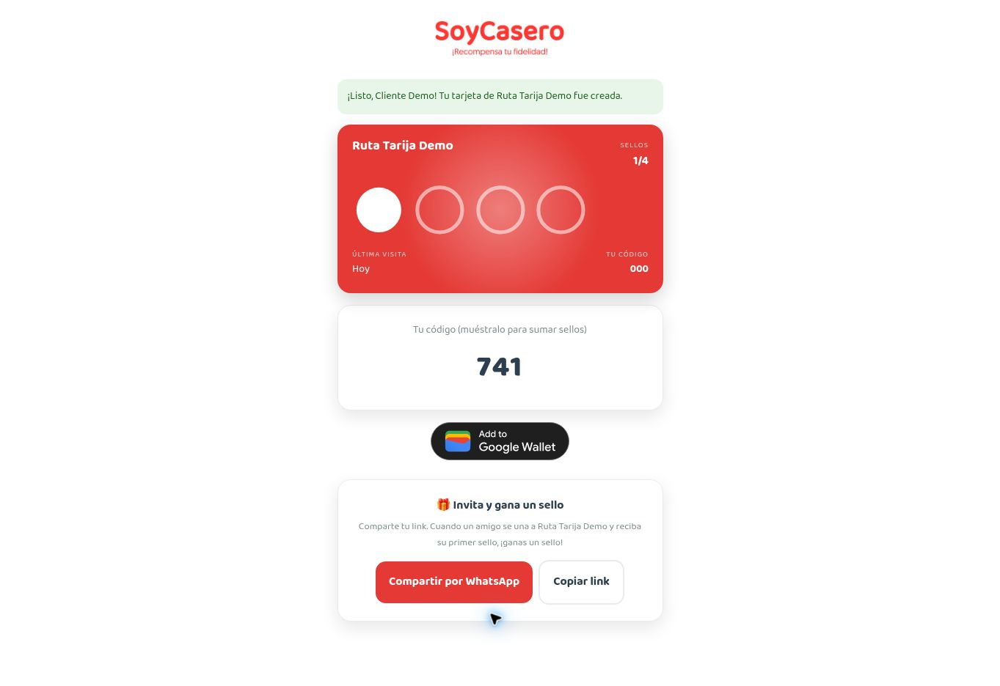
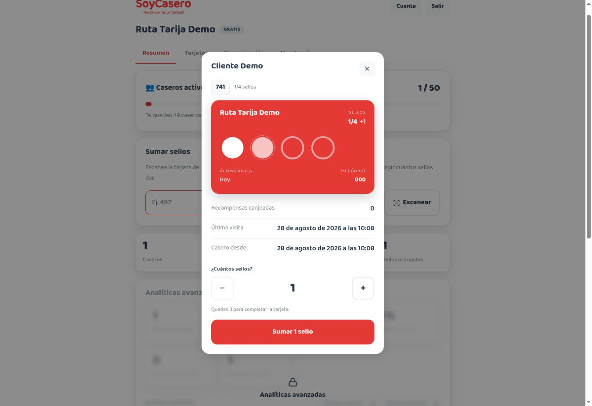
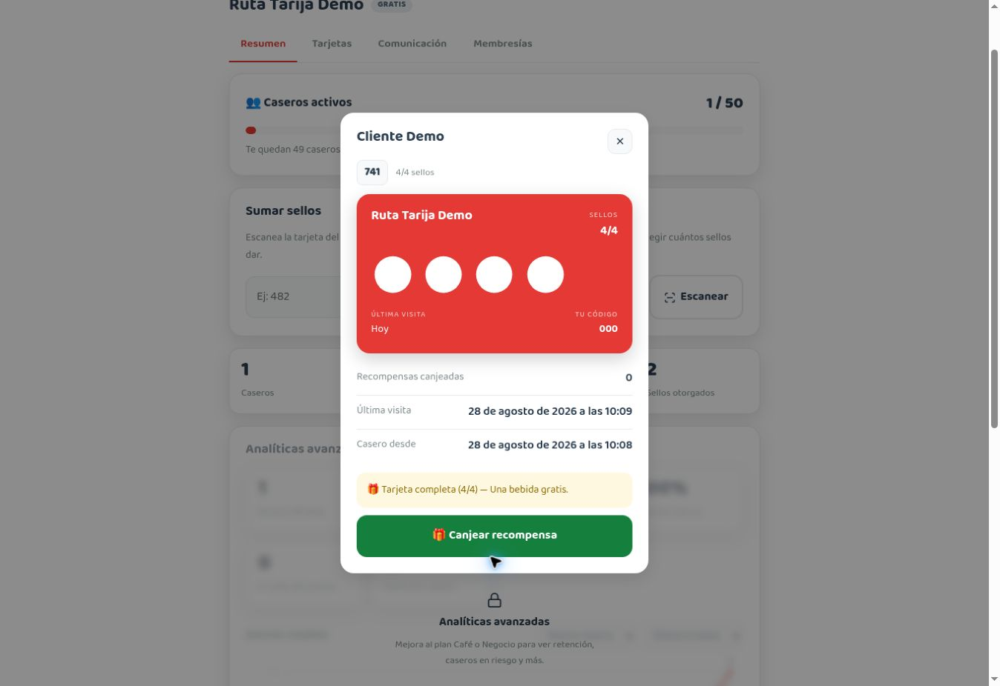
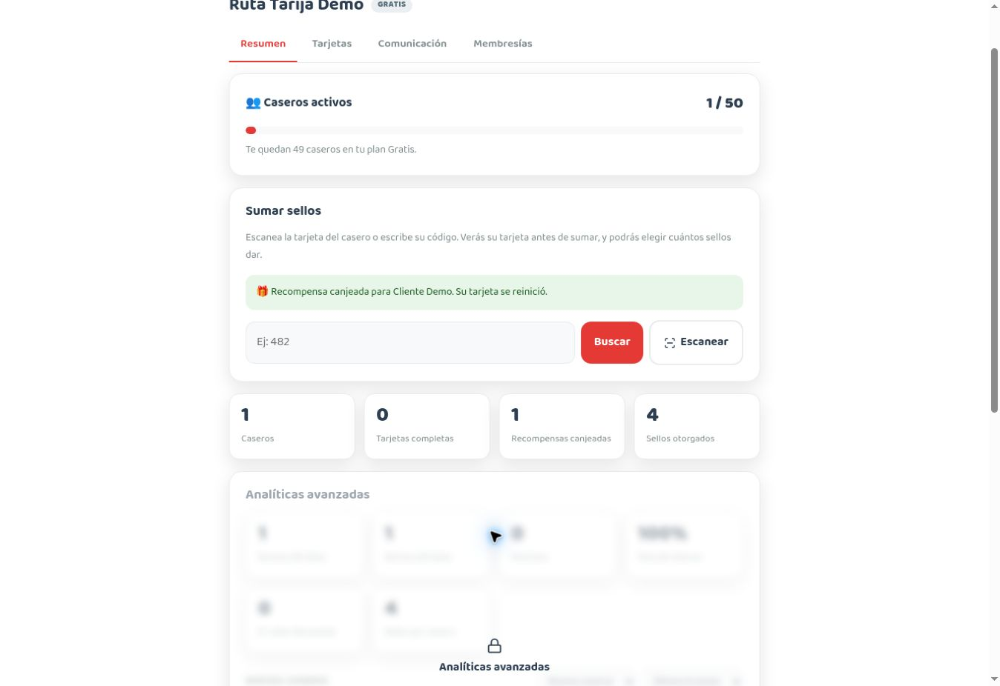
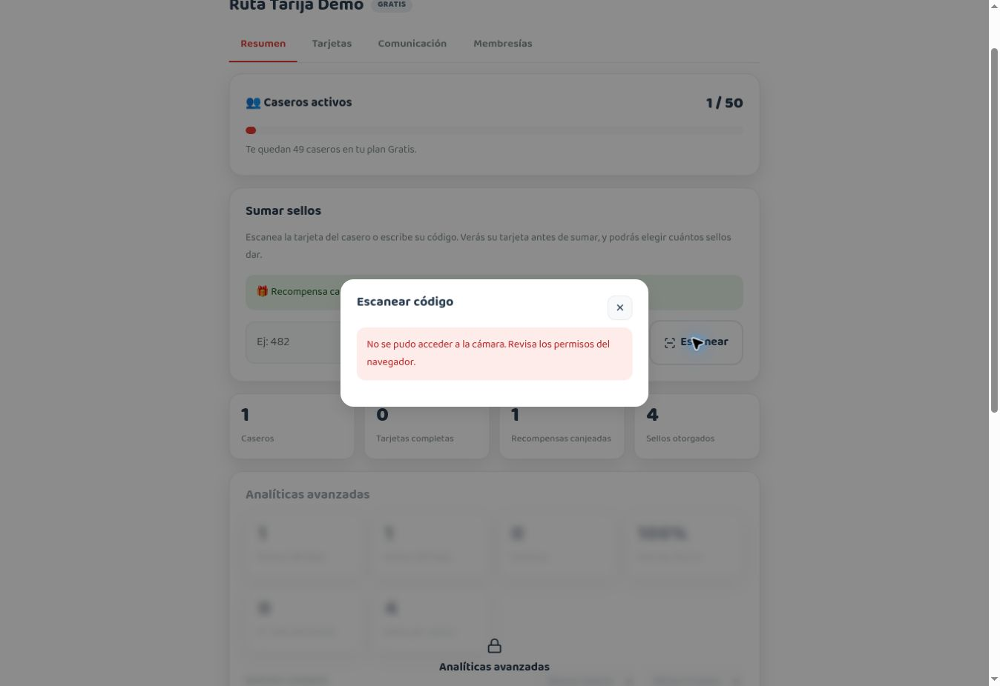

# **DeTuristaAndo** Market Analysis

This document defines the market position of **DeTuristaAndo**. The reviewed public sources were verified on **1 September 2026**. Published capabilities do not prove adoption, revenue, or economic impact.

## Conclusion

The product category exists. Local discovery platforms expose places, loyalty tools reward repeat visits, and digital passport platforms connect several locations through check-ins and rewards.

[Bandwango](https://www.bandwango.com/) is the closest direct reference found. It offers no-app mobile passes, place discovery, check-ins, goals, rewards, an experience builder, and analytics. **DeTuristaAndo** must not claim that the general model is new.

The product has a narrower operating model:

> **DeTuristaAndo** lets a small organizer publish one unordered local experience. Visitors use an anonymous web and Google Wallet pass. Each business receives a limited validator. Progress counts distinct businesses and requires no sales-system integration.

The practical differentiation is the combination of scope, access model, low setup effort, and local visual identity. No isolated feature is a durable advantage.

## Target market

The primary customer is an organizer that already coordinates several independent businesses.

Examples include a book fair, restaurant week, specialty coffee fair, producer association, cultural night, commerce association, motorcycle gathering, or temporary festival.

The initial experience has:

- Defined start and end dates.
- At least two participants.
- One accountable organizer.
- A goal based on distinct participants.
- A non-monetary benefit with clear responsibility.
- Businesses that can use a mobile browser but cannot integrate a sales system.

Large destination organizations are a later segment. Their procurement, support, branding, reporting, and localization needs exceed MVP01.

## Current alternatives

| Product or workflow | Verified strength | **DeTuristaAndo** position |
|---|---|---|
| [Bandwango](https://www.bandwango.com/) | Mature destination passports, check-ins, rewards, data, and analytics. | Smaller self-service scope, anonymous participation, Google Wallet, and limited business access. |
| [Google Business Profile](https://support.google.com/business/answer/7039811?hl=en) | Individual places in Search and Maps. | One organizer-owned experience with shared progress and benefit. |
| [SoyCasero](https://www.soycasero.com/) | Simple Wallet loyalty, QR enrollment, staff validation, rewards, and analytics. | Discovery across distinct independent businesses instead of repeat loyalty to one program. |
| [Loopy Loyalty](https://loopyloyalty.com/features/) and [Stamp Me](https://www.stampme.com/how-it-works) | Wallet loyalty, multiple locations, staff operation, and rewards. | A finite local experience rather than an ongoing loyalty network. |
| [Goosechase](https://goosechase.com/download) | Guest participation, missions, GPS, points, teams, and leaderboards. | Business-confirmed visits and benefit redemption instead of a challenge game. |
| Event page, social posts, or Maps list | Low-cost promotion with familiar tools. | Adds authorization, individual progress, completion, redemption, and operational measures. |
| Paper passport | Simple physical interaction. | Adds updates, recovery, audit, and measurable cross-business activity. |

The product is relevant when promotion alone is not enough and the organizer needs verified visits, progress, a benefit, and shared operating visibility.

## Capability position

`Partial` means that public evidence shows a related feature but not the same domain rule.

| Capability | **DeTuristaAndo** | Bandwango | SoyCasero | Goosechase |
|---|---:|---:|---:|---:|
| Curated multi-business experience | Yes | Yes | No | Partial |
| Unordered distinct-business goal | Yes | Partial | No | Partial |
| No product account for the visitor | Yes | Sign-up shown | Enrollment | Guest mode |
| No native application required | Yes | Yes | Wallet use | Yes |
| Google Wallet in the initial release | Yes | Not found in reviewed flow | Yes | No |
| Business-confirmed visit | Yes | Check-in method varies | Yes | No |
| Limited business access | Yes | Not confirmed | Staff accounts | Not applicable |
| One completion benefit with final redemption | Yes | Rewards | Yes | Organizer-defined prize |
| No POS or payment integration | Yes | Optional paid-pass models exist | Yes | Yes |

Public documentation can be incomplete. The table does not prove that an unlisted feature is absent.

## SoyCasero benchmark

SoyCasero is the main usability and Wallet reference. It is not the product or commercial model for **DeTuristaAndo**.

The research used a free business account and fictitious data. It did not enable promotional consent. The captured flow was reviewed on **28 August 2026**.

### Observed flow

1. A business creates an account and configures a stamp goal, reward, colors, and card content.
2. A live preview shows the card during configuration.
3. Publication creates a public QR and shareable link.
4. A customer enrolls and receives a web card, short code, and Wallet action.
5. Staff scan or enter the customer code and review the state before confirmation.
6. The card updates after each stamp, reward unlock, and redemption.

The public site also lists notifications, referrals, segmentation, analytics, export, membership cards, and multi-cashier access across its plans. Those capabilities are later commercial references, not MVP01 scope.

### Evidence

| Evidence | Observation |
|---|---|
|  | The public page combines value, progress, acquisition, and QR. |
|  | The preview reduces configuration uncertainty. |
|  | Publication produces digital and printable distribution material. |
|  | The customer receives web, manual-code, and Wallet paths. |
|  | Staff review context before a state change. |
|  | Progress and benefit availability are separate states. |
|  | Redemption produces an explicit result. |
|  | Manual lookup remains available after camera failure. |

### Lessons applied

- Show value before activation.
- Keep configuration guided and previewable.
- Provide QR, link, print, camera, and manual-code paths.
- Show context before visit or redemption mutations.
- Confirm results immediately and specifically.
- Keep progress, available benefit, and redeemed benefit as separate states.

### Patterns not copied

- One card per business.
- Stamp and repeat-loyalty language.
- Required visitor contact data.
- Short public-facing validation credentials.
- Visual identity, card geometry, typography, or color.
- Automatic reset after redemption.
- Subscription prompts in MVP01.

## Positioning

For organizers that already coordinate local businesses, **DeTuristaAndo** publishes one visual, visit-any-order experience with anonymous passes, business-confirmed visits, distinct-place progress, and one benefit. It avoids business dashboards, visitor accounts, native applications, POS integration, payment handling, and participant negotiation.

The following choices reduce abandonment:

| Friction | Product response |
|---|---|
| Organizer must load many participants. | Short builder, saved draft, list paste, optional detail, and preview. |
| Business receives another account invitation. | One-time link, device activation, PIN, and two primary operations. |
| Staff confuse public and private QR codes. | Different labels, visual treatment, instructions, and physical placement. |
| Visitor sees another registration form. | Anonymous participation before Wallet delivery. |
| Wallet or camera is unavailable. | Private web pass and manual code from the same flow. |
| Connectivity makes confirmation uncertain. | Explicit pending/final states and idempotent operations. |
| Benefit responsibility is unclear. | Owner, capacity, expiry, conditions, and redemption points before publication. |
| Organizer expects participant recruitment. | State the pre-coordination requirement before registration. |

## Commercial direction

MVP01 is free and contains no billing behavior.

| Model | Description | Trade-off |
|---|---|---|
| First published experience free | Charge a one-time fee for later publications. | Clear value before payment; revenue is irregular. |
| Organizer plan | Charge for concurrent experiences, teams, reuse, and advanced analytics. | Predictable revenue; weak fit for occasional organizers. |
| Free core with paid services | Charge for communication, branding, onboarding, promotion, or exports. | Lowest entry friction; paid value must remain clear. |

The first commercial test should use the first-published-experience-free model. It matches temporary events without introducing a subscription before recurring usage exists.

## Product measures

The product measures its workflow and does not label a visit as a sale.

| Stage | Measure |
|---|---|
| Discovery | Experience views and landing-to-participation conversion. |
| Business readiness | Invitation-to-activation conversion and time to first validation. |
| Visitor activation | Private pass created and Wallet save result when available. |
| Cross-business movement | Second accepted visit at a different business. |
| Completion | Distinct businesses per participation and `K/N` completion rate. |
| Benefit | Entitlement and redemption rate. |
| Friction | Rejected scans, camera fallback, failed Wallet updates, and abandoned organizer drafts. |

The primary measure is the share of participations with a second accepted visit at a different business.

## Sources

- [Bandwango overview](https://www.bandwango.com/) and [passholder experience](https://www.bandwango.com/product/passholder-experience).
- [Google Business Profile](https://support.google.com/business/answer/7039811?hl=en).
- [SoyCasero](https://www.soycasero.com/) and [public example](https://www.soycasero.com/ejemplo).
- [Loopy Loyalty](https://loopyloyalty.com/features/).
- [Stamp Me](https://www.stampme.com/how-it-works).
- [Goosechase](https://goosechase.com/download).
- [Google Wallet Generic Pass](https://developers.google.com/wallet/generic).

Desk research can miss private, temporary, municipal, or social-media-only deployments. This analysis defines a defensible position without claiming complete market coverage.
