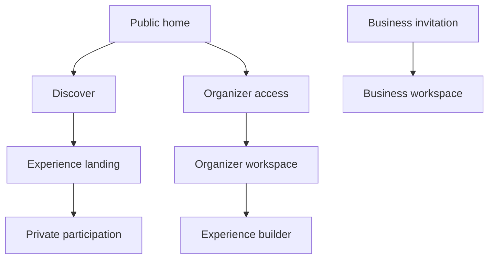

# **DeTuristaAndo** UI/UX Guidelines

This document translates the [conceptual design](conceptual-design.md) into an interaction and visual direction. It guides formal design without fixing every layout or pixel value.

## Experience goal

**DeTuristaAndo** must feel like an invitation to go out, move, and discover. Public pages are visual, energetic, and relaxed. Operational screens remain focused because businesses use them during live service.

The product uses one dark identity. It does not provide a light theme in MVP01.

## Interaction principles

- Show the experience value, goal, benefit, dates, and participants before activation.
- Keep one primary action per viewport or task state.
- Let visitors participate without forms or accounts.
- Let businesses validate from one focused workspace.
- Explain public QR, private credential, visit, progress, and redemption with different words and visuals.
- Show the expected effect before a state-changing confirmation.
- Keep camera and manual-code paths together.
- Preserve visible recovery after external or connectivity failure.

## Information architecture

The public flow optimizes discovery and activation. The organizer flow optimizes readiness. The business flow optimizes fast, reliable counter operation.

## Screen intent

| Screen | Must communicate | Primary action |
|---|---|---|
| Public home | What the product does and examples of current experiences. | Discover or create an experience. |
| Discovery | Available experiences by place, date, category, and audience. | Open an experience. |
| Experience landing | Story, participants, unordered map, dates, `K/N` goal, benefit, and conditions. | Activate participation. |
| Private participation | Progress, visits, next discovery options, credential, and benefit state. | Open Wallet or present credential. |
| Organizer workspace | Owned experiences, status, readiness, and key results. | Continue draft or create experience. |
| Experience builder | Required configuration with landing and card previews. | Save, preview, or publish. |
| Business invitation | Organizer, experience, participant, permissions, and expiry. | Activate this device. |
| Business workspace | Own material, scanner, manual code, redemption, and own activity. | Validate visit. |
| Validation review | Exact context, expected effect, and prior result. | Confirm or cancel. |

## Public landing pages

The landing pages carry most of the brand expression.

- Use a strong visual hero with a thematic illustration created for the experience.
- Keep experience name, locality, date, and main action visible without scrolling on common mobile screens.
- Present the `K/N` goal as a challenge, not as loyalty points.
- Show participant cards before long conditions or organizer detail.
- Treat the map as exploration support. Do not imply route order or draw a mandatory path.
- Use editorial sections, horizontal card rails, bold type, and short copy instead of dashboard grids.
- Repeat the activation action after the participant and benefit sections.

## Organizer builder

Use a guided sequence with saved progress:

1. Identity and visual material.
2. Dates, place, and discovery settings.
3. Participants.
4. Goal and benefit.
5. Redemption responsibility.
6. Preview and publication readiness.

Keep each step focused on a small related group of fields. Optional detail stays collapsed until requested. A readiness summary links to incomplete sections instead of presenting a wall of errors.

The preview must show the public landing and Google Wallet information hierarchy before publication.

## Business workspace

The workspace has two dominant actions:

- Validate a visit.
- Redeem a benefit when this participant is authorized.

Public material and own activity are secondary. The validator opens the camera directly when permission is available and keeps manual entry visible. The confirmation view shows business, experience, current progress, requested action, and expected result.

Result states use explicit language:

- Visit confirmed; first visit to this business.
- Visit confirmed; repeated visit, distinct progress unchanged.
- Goal completed; benefit now available.
- Benefit redeemed.
- Operation already processed.
- Operation rejected with the recovery action.

## QR system

| Code | Purpose | Visual treatment |
|---|---|---|
| Public discovery QR | Opens the experience and records acquisition source only. | Neon-green frame, discovery icon, and “Discover this experience”. |
| Private validation QR | Identifies one participation for business confirmation. | High-contrast monochrome code inside Wallet or private view; never used on posters. |
| Manual code | Recovers the private validation flow when scanning fails. | Grouped characters with copy and read-aloud spacing. |

Do not distinguish the codes only by color. Use name, icon, instruction, and placement.

## Google Wallet card

The card is a compact access surface, not the complete experience page.

Information priority:

1. Experience identity.
2. Progress `K/N`.
3. Benefit state.
4. Private validation QR.
5. Validity and link to the private web view.

The Wallet design uses the same dark and neon identity. It must remain legible under provider layout constraints and must not depend on animation or glow.

## Visual system

### Character

The visual language is **night discovery**: black space, fluorescent color, illustrated movement, and social energy. It should feel fun, cool, and chill without becoming childish or visually noisy.

### Color roles

The values below are starting tokens. Formal design can adjust them after contrast and device tests.

| Role | Starting direction | Use |
|---|---|---|
| Canvas | Near-black green or charcoal, such as `#080A08`. | Page background. |
| Surface | Deep neutral green, such as `#111510`. | Navigation, forms, and operational cards. |
| Neon primary | Electric lime, such as `#B8FF3D`. | Featured experience cards, primary actions, progress, and focus. |
| Neon support | Mint or cyan, such as `#42FFB0`. | Secondary highlights and map state. |
| Purple accent | Saturated violet, such as `#9B5CFF`. | Illustration depth, gradients, and secondary emphasis. |
| Complementary accent | Cyan, magenta, or warm acid yellow. | Small illustration details and celebratory moments. |
| Main text | Warm off-white. | Body text on dark surfaces. |
| Dark text | Near-black. | Text on neon-filled cards and buttons. |
| Status colors | Separate success, warning, and error values. | Operational feedback with icon and text. |

Featured experience cards use a neon-green fill with dark text. Standard cards use a dark surface with a neon edge or small glow. Avoid a strong glow on every component; it reduces hierarchy and readability.

### Illustration system

The provided visual reference defines style, not subject matter. Use these characteristics:

- High-saturation illustration on a black or near-black field.
- Neon green as the dominant product color, supported by saturated purple and small complementary accents.
- Strong silhouette, thick contours, layered volume, and controlled fluorescent glow.
- Organic, liquid, or energetic shapes that suggest movement between places.
- A poster, street-art, or contemporary comic energy without copying a specific artwork or character.
- A clear central subject related to the experience, such as food, books, coffee, wine, music, motorcycles, or local craft.

Use illustration in public heroes, featured cards, empty states, and completion moments. Keep forms, maps, QR codes, and validator screens visually stable. Do not place decorative detail behind essential text or scanning surfaces.

The platform identity is illustration-first. Organizer logos and participant photographs can provide factual context, but they do not replace the main illustrated language. Avoid generic stock tourism, clip art, photorealistic AI imagery, and text embedded inside illustrations.

### Typography and media

- Use a bold geometric display face, such as Space Grotesk, for names and major headings.
- Use a highly legible sans-serif, such as Inter, for body and operational content.
- Use large display type and short lines on public pages.
- Preserve a clean area around illustrated subjects for responsive crops.
- Require alternative text when an illustration communicates content rather than decoration.

### Shape, depth, and motion

- Use rounded cards and deliberate overlap on public pages.
- Use flat, stable surfaces in forms and validator screens.
- Use borders, contrast, and one restrained shadow or glow layer to express depth.
- Use short entrance, progress, and completion motion only when it clarifies state.
- Respect `prefers-reduced-motion` and keep all tasks usable without animation.

## Responsive and accessibility baseline

- Design public and validator flows mobile first.
- Keep the primary touch target at least `44 × 44` CSS pixels where practical and never below WCAG 2.2 minimum target rules.
- Keep normal text contrast at least `4.5:1` and large text at least `3:1`.
- Provide visible keyboard focus and semantic labels.
- Do not use color, glow, motion, or position as the only state indicator.
- Keep content usable at `200%` zoom.
- Use text alternatives for meaningful images and accessible names for icons.
- Test neon colors on mid-range mobile displays and in bright ambient light.

## Responsiveness metrics

| Signal | Target or behavior |
|---|---|
| Direct control feedback | Show a visual response within `100 ms`. |
| Operation longer than `300 ms` | Show pending state and prevent duplicate action. |
| LCP | At or below `2.5 s` at the 75th percentile. |
| INP | At or below `200 ms` at the 75th percentile. |
| CLS | At or below `0.1` at the 75th percentile. |

Measure public discovery and validation separately. A neon visual identity does not justify heavy media, blocking fonts, or decorative scripts.

## Relationship to SoyCasero

Keep SoyCasero's strongest interaction lessons: preview during setup, clear Wallet delivery, scan plus manual fallback, confirmation before mutation, and explicit benefit state.

Do not copy its layout, palette, card geometry, loyalty language, or visual tone. **DeTuristaAndo** uses a dark, neon, discovery-led identity and one shared multi-business experience.

## References

- [Current Core Web Vitals](https://web.dev/articles/vitals).
- [WCAG 2.2 text contrast](https://www.w3.org/WAI/WCAG22/Understanding/contrast-minimum.html).
- [WCAG 2.2 target size](https://www.w3.org/WAI/WCAG22/Understanding/target-size-minimum.html).
